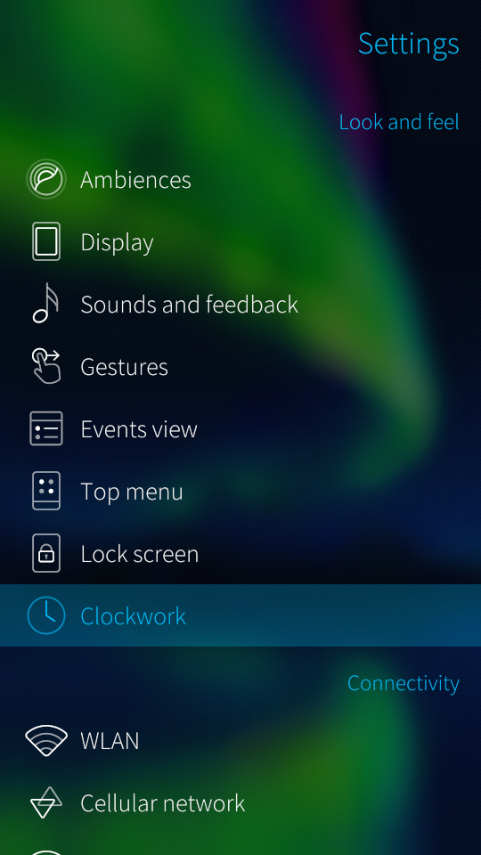
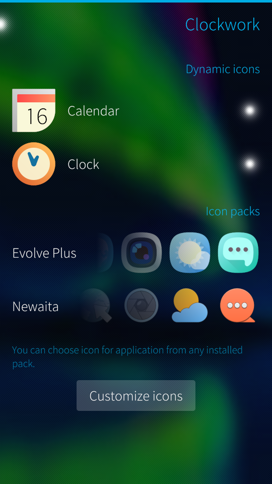
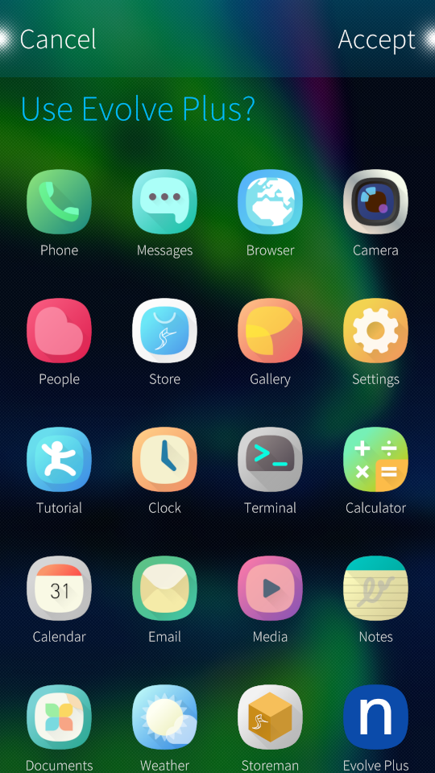

<div align="center">
    
    <h3 align="center">Clockwork</h3>
    <p>Customize your Sailfish OS launcher icons</p>
</div>

## About

Clockwork allows you to customize Sailfish OS launcher icons and dynamically
update them.

You can instantly apply any icon pack made for [Theme pack support for Sailfish OS].

There is built-in support of dynamic icon plugins: you can create custom one
to dynamically update icon for *any* application. Default dynamic icon plugin
supports updating of Clock and Calendar icons.


## Screenshots

<p float="left">
    
    
    
</p>


## Contributing

Stick to [Sailfish OS Coding Conventions] when writing new code.

For C++ code you may use clang-format, like this:

```bash
clang-format-9 --sort-includes -i **/*.cpp **/*.h
```

Note that clang-format doesn't formats `connect()` properly.
E.g. code should be formatted as:

```c++
connect(sender, &MySender::valueChanged,
        receiver, &MyReciever::updateValue);
```

but clang-format gives us this:

```c++
connect(sender,
        &MySender::valueChanged,
        receiver,
        &MyReciever::updateValue);
```

So, don't trust him about automatic `connect()` format changes.


## License

Clockwork is provided under the [MIT license](LICENSE).


[Sailfish OS Coding Conventions]: https://sailfishos.org/wiki/Coding_Conventions
[Theme pack support for Sailfish OS]: https://github.com/uithemer/themepacksupport-sailfishos
